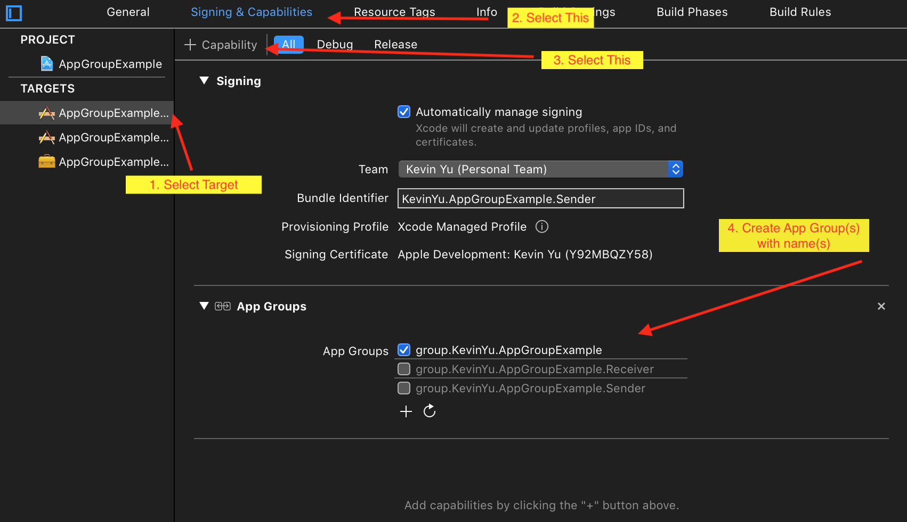

#  AppGroup Tutorial

[App Group Entitlements](https://developer.apple.com/documentation/bundleresources/entitlements/com_apple_security_application-groups)

# Why use App Groups?

* Allows multiple apps of a developer to share some local data.

* iOS apps are all sandboxed-they have no access to one another's data under normal circumstances.

# Setting up your App Group:

Images are a thousand words. Use the following to get started.

Once done, it'll create an `.entitlements` file, if your app does not have one already.

Within this file, each group is described as an entry within an array.

# This Demo App:

For the entitlements, ensure that you use your respective item's value, as demonstrated in this example in`AppGroupSharedConstants.swift`.

You can also utilize a shared group for FileManager for arbitrary file storage, as demonstrated in `SharedFileManager`.

There are two targets, a Sender and a Receiver, which save and load files, respectively, from a common app group.

# Sender Usage:

Type any text and sent the app to an inactive state.

# Receiver Usage:

Open the app after the Sender has been used to save data.
